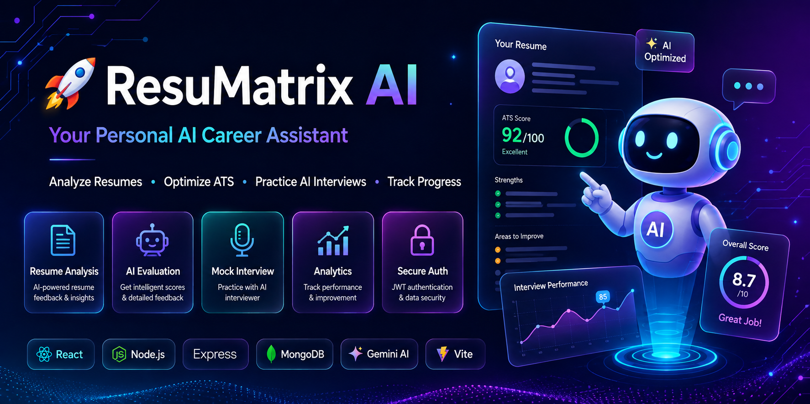

<div align="center">

# 🚀 ResuMatrix AI
### AI-Powered Resume Analyzer & Mock Interview Platform



[]()
[]()
[]()
[]()
[]()

### 🚀 Analyze Your Resume • Practice AI Interviews • Improve Your Career

</div>

---

# 📌 Overview

**ResuMatrix AI** is an intelligent AI-powered career preparation platform that helps students and job seekers optimize their resumes, improve ATS scores, and practice personalized mock interviews using **Google Gemini AI**.

Instead of simply analyzing resumes, ResuMatrix acts as an **AI Career Assistant**, providing resume evaluation, AI-generated interview questions, performance analytics, and actionable improvement suggestions.

---

# ✨ Features

## 📄 AI Resume Analyzer

- Upload Resume (PDF)
- AI Resume Analysis
- ATS Score Prediction
- Resume Strengths
- Weaknesses Detection
- Missing Skills
- Resume Improvement Suggestions
- Resume History

---

## 🎤 AI Mock Interview

- AI Generated Questions
- Resume Based Questions
- Job Description Based Questions
- HR Questions
- Technical Questions
- Behavioral Questions
- Scenario Based Questions
- Project Based Questions

---

## 🎙 Voice Interview (Browser Speech API)

- Speech-to-Text
- Browser Voice Recognition
- English & Indian Accent Support
- Hands-Free Interview Experience

---

## 🤖 AI Evaluation

Gemini AI evaluates every answer based on:

- Technical Knowledge
- Communication Skills
- Confidence
- Problem Solving
- Clarity
- Grammar
- Professionalism

After every interview users receive:

- ⭐ Overall Score
- 📊 Performance Breakdown
- 💡 AI Feedback
- 📚 Improvement Suggestions
- ✅ Ideal Answers

---

## 📈 Dashboard

- Interview History
- Resume Analysis History
- Performance Tracking
- Score Comparison
- User Profile
- Account Settings

---

## 🔐 Authentication

- JWT Authentication
- Secure Login
- Secure Signup
- Forgot Password
- Password Reset via Email
- Protected Routes
- Password Hashing using bcrypt

---

# 🖼 Screenshots

> Add screenshots here after deployment.

```
Landing Page

Dashboard

Resume Analyzer

Mock Interview

Analytics

Settings
```

---

# 🛠 Tech Stack

## Frontend

- React 19
- Vite
- Tailwind CSS
- Framer Motion
- Axios
- React Router

---

## Backend

- Node.js
- Express.js
- MongoDB Atlas
- Mongoose
- JWT Authentication
- bcrypt
- Multer
- Nodemailer / Resend

---

## AI

- Google Gemini 2.5 Flash
- Prompt Engineering

---

## Browser APIs

- Speech Recognition API
- Speech Synthesis API

---

## Deployment

- Vercel
- Render
- MongoDB Atlas

---

# 📂 Project Structure

```
ResuMatrix/
│
├── frontend/
│   ├── src/
│   ├── components/
│   ├── pages/
│   ├── hooks/
│   ├── services/
│   └── assets/
│
├── backend/
│   ├── controllers/
│   ├── middleware/
│   ├── models/
│   ├── routes/
│   ├── services/
│   ├── utils/
│   └── uploads/
│
└── README.md
```

---

# ⚡ Installation

## Clone Repository

```bash
git clone https://github.com/Shubham46-glitch/ResuMatrix.git

cd ResuMatrix
```

---

## Install Dependencies

```bash
npm install
```

or

```bash
cd frontend
npm install

cd ../backend
npm install
```

---

# 🔑 Environment Variables

Backend

```env
PORT=5000

MONGO_DB_URL=

JWT_SECRET=

GEMINI_API_KEY=

EMAIL_USER=

EMAIL_PASS=

CLIENT_URL=
```

Frontend

```env
VITE_API_URL=http://localhost:5000
```

---

# ▶ Run Project

```bash
npm run dev
```

---

# 🚀 Future Roadmap

- AI Resume Rewriter
- AI Cover Letter Generator
- Resume Version Comparison
- AI Career Roadmap
- AI Job Recommendations
- AI Portfolio Review
- Voice Mock Interview
- Resume Keyword Optimizer
- AI Career Coach
- Multi-language Support

---

# 💻 Built With

- React
- Node.js
- Express.js
- MongoDB
- Gemini AI
- Tailwind CSS
- Vite

---

# 👨‍💻 Author

## Shubham Baikar

B.Tech Information Technology

Passionate about Full Stack Development • AI • Data Analytics

⭐ If you like this project, don't forget to star the repository!

---

<div align="center">

### 🌟 Star this repository if you found it useful!

Made with ❤️ by **Shubham Baikar**

</div>
